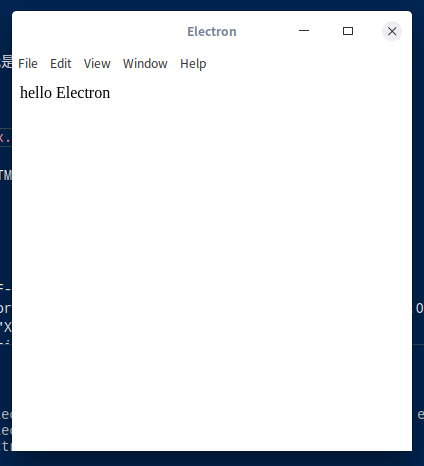
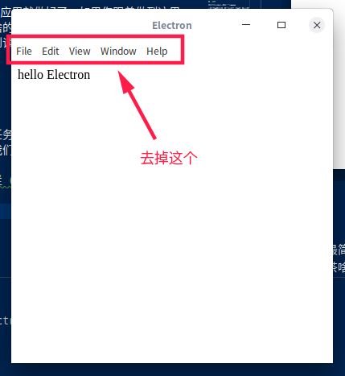
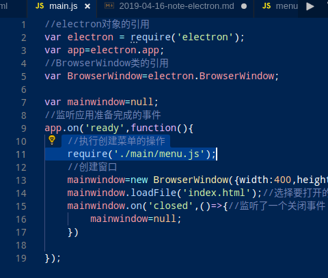
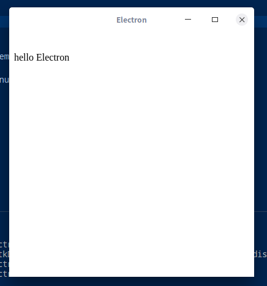
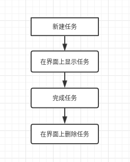
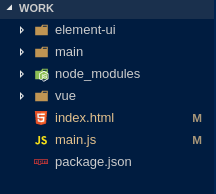
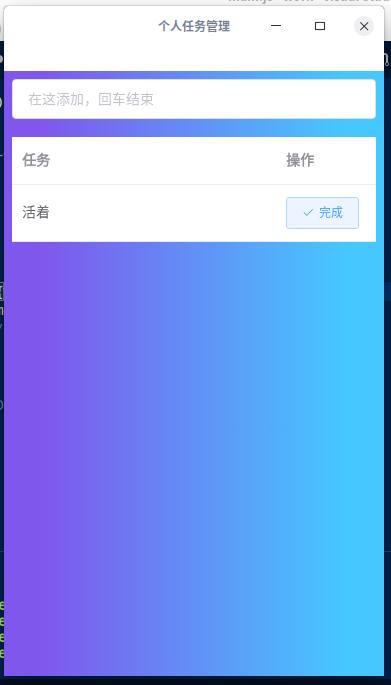
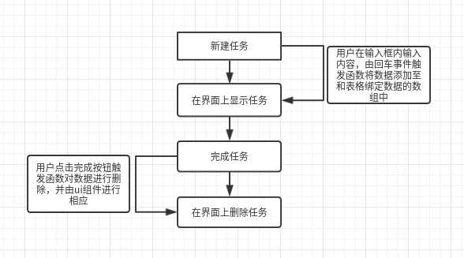

# 前言

额，首先感谢一位集各种灵巧走位和花式甩锅技巧为一身的萨克斯大神，不然本人绝对接不到如此简单明了（丧心病狂）的任务；由于是第一次接到这样任务，第一件事肯定是去查找之前大神们留下的文档以防撞车，绝对不是抱着如果有模板就去抄一份的龌龊思想，然后...感谢各位大神，如果不是在细细品读（伺机抄袭）的过程中被虐的死去活来的话，我现在也不会有思路写下这篇文章，讲真好多文章都是开头带着读者：来，这是1，这是2，1+2等于几啊？3！哎！真棒！然后不知道哪段，突然：来，我们看一下微积分，这边先来求个导...您们是魔鬼吗！？这还不算那些开头就开始傅里叶变幻的，小白膝盖骨都碎成渣了好嘛...此处应配图：


# 正篇

## 简单介绍

Electron 基于 Chromium 和 Node.js, 让用户可以使用 HTML, CSS 和 JavaScript 构建应用，并且Electron兼容 Mac, Windows 和 Linux， 它构建的应用可在这三个操作系统上面运行，当然了它是开源的。

## 环境搭建

这里只介绍deepin系统环境的搭建方法，windows或mac百度上太多了，而且绝对比我的全。

### 安装nodejs和npm

`sudo apt-get install nodejs npm`

检查方法：

`node -v`和`npm -v`

看见了版本号基本上就OK

### 安装cnpm（国内的npm）

用淘宝的源下载cnpm

`sudo npm install -g cnpm --registry=https://registry.npm.taobao.org`

注：-g 表示全盘安装 ，sudo 最好加上不然会报权限不足的错误(root用户当我没说)

### 安装electron

`sudo cnpm install electron electron-forge -g`


## 编辑器

首推使用vscode（宇宙无敌超级至尊）

记得安装一些html相关的插件，当然不装也没关系，之后写代码他会在右下角弹出推荐你安装的插件，点一下就好。

## 手动创建一个项目

创建一个目录，地点随意，我是在家目录

`mkdir ~/work`

在vscode里新建一个`index.html`文件

内容随便，这里我填了一个HTML5的模板：

``` 
<!DOCTYPE html>
<html lang="en">
<head>
    <meta charset="UTF-8">
    <meta name="viewport" content="width=device-width, initial-scale=1.0">
    <meta http-equiv="X-UA-Compatible" content="ie=edge">
    <title>electron</title>
</head>
<body>
    hello electron
</body>
</html>
```
接下来创建` main.js`文件，内容如下:


``` 
 //electron对象的引用
 var electron = require('electron');
 var app=electron.app;
 //BrowserWindow类的引用
 var BrowserWindow=electron.BrowserWindow;

 var mainwindow=null;
 //监听应用准备完成的事件
 app.on('ready',function(){
     //创建窗口
     mainwindow=new BrowserWindow({width:400,height:400});
     mainwindow.loadFile('index.html');//选择要打开的主页文件
     mainwindow.on('closed',()=>{//监听了一个关闭事件
         mainwindow=null;
     })
 })
```


然后在命令行里输入` npm init --yes`

之后可以发现多了一个` package.json`文件

内容如下：


``` 
{
  "name": "你的文件夹名",
  "version": "1.0.0",
  "description": "",
  "main": "main.js",
  "scripts": {
    "test": "echo \"Error: no test specified\" && exit 1"
  },
  "keywords": [],
  "author": "",
  "license": "ISC",
  "devDependencies": {
    "babel-preset-env": "^1.7.0"
  }
}
```


尤其要注意，看看你的` main`是否指向` main.js`。

之后就可以运行试试看了，执行`electron .`

### 这里注意，大概率会报错：

遇到：

``` 
App threw an error during load
Error: Couldn't find preset "env" relative to directory...
```
需要在当前文件夹内执行：

` cnpm install babel-preset-env --save-dev`

遇到：
``` 
App threw an error during load
Error: Couldn't find preset "react" relative to directory ...
```
执行：
``` 
npm install react react-dom 
npm install babel-core babel-loader babel-preset-react 
npm install webpack 
```

最后执行`electron .`

应该看到下图的界面：



### 想去掉上面的那行菜单栏（见图片）




在此之前先把vscode中对electron的代码提示弄出来

在work目录下执行

`cnpm install electron --save`

这样表示把electron下载到当前目录下的node_modules文件夹中了

之后就会有代码提示

在work目录下新建一个main文件夹

在main文件夹里新建一个`menu.js`

内容为：
```
//electron对象的引用
var electron=require('electron');
//electron.Menu对象的引用
var Menu=electron.Menu;
//创建一个空菜单
let template=[];
//实例化
var m=Menu.buildFromTemplate(template);
//传值
Menu.setApplicationMenu(m);
```

然后在main.js的`app.on('ready',function(){`这行下面添加：
```
 //执行创建菜单的操作
    require('./main/menu.js');
```
像这样：


之后再执行`electron .`应该会看到下面的样子：



这样就成功了。

## 休息
至此一个最简单的electron应用就做好了，如果您跟着做到这里了，建议休息一下，喝杯茶啥的活动活动，放心本文不含任何的防不胜防，我会尽量做到代码粘到读者那就能用，请放心往下看。

## 任务管理软件

### 需求

这里要做的是一个最基本的任务管理，那么最基本的需求就是添加任务和删除任务了。

流程大概是这种感觉：



## 正式开始

之前介绍里讲了electron可以算是用了浏览器的技术来将网站封装成桌面应用，所以网页的制作占了很大的部分，接下来会用到的其他前端知识我都会写注释，目标是小白可以复刻出这个程序，用到的知识可以之后再补，但兴趣这东西是说没就没啊...

### 选择所需的技术

这里选择的是`vue`框架以及`element-ui`这个ui组件

### 准备工作

首先下载`vue`和`element-ui`

在当前目录下执行：

```
cnpm install vue --save
cnpm install element-ui --save
cp -r node_modules/_vue* ./vue
cp -r node_modules/_element-ui* ./element-ui
```

这样在当前目录里就可以得到`element`和`vue`这两个文件夹

当前的工作区应该是这样：



### 实现

根据需求来的话需要一个输入框和一个显示区域，其他就是逻辑层面的对每一步操作进行数据绑定来实现想要的效果。
废话不多说直接上代码，将`index.html`的内容修改为如下：

```
<!DOCTYPE html>
<html lang="en" >

<head>
  <meta charset="UTF-8">
  <title>个人任务管理</title>
  <!-- 这里引用element-ui的样式 -->
  <link rel="stylesheet" href="./element-ui/lib/theme-chalk/index.css">
  <!-- 定义一个样式用于 窗口的背景色 -->
  <style>
    .box {
    background:linear-gradient(to right, #7f57ec 10%,#00b3ffb9 90%);
    }
  </style>
</head>
<!-- 这里调用了背景的样式 -->
<body class="box" >
<!-- 这里引用的是vue和element-ui组件的js文件，基本用于实现逻辑和element-ui的一些动态效果 -->
<script src="./vue/dist/vue.js"></script>
<script src="./element-ui/lib/index.js"></script>
<!-- 这里调用了vue的一个类似于函数块一样的东西，我姑且是这样理解的，块名称为add-->
<div id="add" >
<!-- 这里就是一个输入框了，v-model是vue用来绑定数据的，tag是在add块里面定义的一个变量，placeholder="在这添加，回车结束"表示的是给用户的默认提示，
v-on后面绑定的是事件，这里绑定了一个回车事件，当用户在这个输入框内输入回车时会触发add块里定义好的add_tag函数，函数会执行相应的数据操作 -->
  <el-input  v-model="tag" placeholder="在这添加，回车结束" v-on:keyup.enter.native="add_tag" ></el-input>
</div>
<!-- 硬核空一行 -->
<br>
<!-- 于上面类似调用一个名为app的函数块 -->
<div id="app">    
<!-- 这里定义了一个表格，数据绑定的是app块里面的tabledata的这个数组对象，宽度设置为100%，label表示列的标题 -->
  <el-table
    :data="tableData"
    style="width: 100%"
    >
    <el-table-column
      label="任务"
      prop="renwu"
      >
      
    </el-table-column>
    <el-table-column
      fixed="right"
      label="操作"
      width="100">
      <!-- 这里是完成按钮的实现，会帮助用户删除完成的那行数据 -->
      <template slot-scope="scope">
        <el-button
          @click.native.prevent="deleteRow(scope.$index, tableData)"
          type="primary"
          icon="el-icon-check"
          size="small" plain>完成
        </el-button>
      </template>
    </el-table-column>
  </el-table>
</div>

</body>
<script>
  // 这里就是定义函数块的地方，el后表示的是这个块的名字，也就是能被id调用的东西
  var app=new Vue( {
    el:'#app',
    methods: {
      // 这是完成任务的函数
      deleteRow(index, rows) {
        rows.splice(index, 1);
        // 调用了完成的提示
        this.tishi_finsh();
      },
      // 定义了一个完成的提示信息，showclose表示可以被关闭，message表示信息，type其实是element-ui的样式，duration表示提示出现的时间以毫秒为单位，这里表示出现800毫秒后关闭
      tishi_finsh() {
        this.$message({
          showClose: true,
          message: '恭喜完成任务',
          type: 'success',
          duration:800
        });
      }
    },
    // 这里定义是任务的内容，每一次添加其实都是给这个数组里面添加对象
    data:{
      tableData: [{
        renwu:'活着',
      }] 
    }
  })
  // 添加任务块
  var add=new Vue({
    el:'#add',
    data:{
      // 这个变量是和输入框的内容进行绑定的
      tag: ''
    },
    methods: {
      // 当这个函数触发时就把输入框的内容加到任务数据的数组里面去
      add_tag(){
        app.tableData.push({renwu:this.tag});
        this.tag='';
        this.tishi_add();
      },
      // 添加任务成功的提示框
      tishi_add() {
        this.$message({
          showClose: true,
          message: '添加成功',
          type: 'success',
          duration:500
        });
      }
    }
  });
  
</script>
</html>
```

这时执行`electron .`的效果应该是这样的：




实现思路是差不多是这样的：




## 后记：

参考文档：

[VUE官方文档](https://cn.vuejs.org/v2/guide/)

[element-ui官方文档](https://element.eleme.io/#/zh-CN/component/installation)

[electron官方文档](https://electronjs.org/docs)


